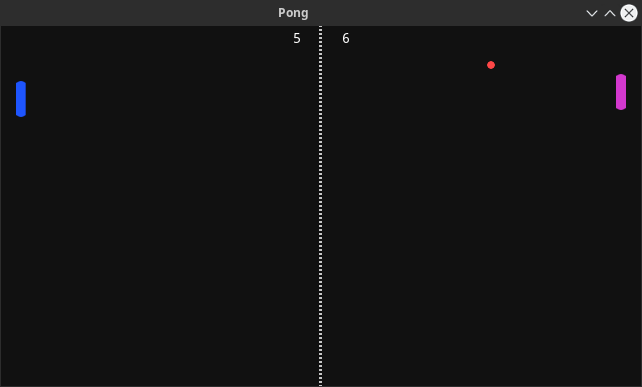

# Pong in Godot

## About

Entire Pong game example in godot 3.1 or up.
All the assets in .xcf(GIMP format) and .png format are provided inside assets directory.

## Roadmap

- [X] Manage Score
- [ ] Start Screen
- [X] Play Sounds
- [X] Player vs Ai Mode

## License and Copyrights
Feel free to copy or redistribute as you wish no credit required (Both game and assets). (entirely optional but great if you can give link to my website https://kubre.in). Open issue if you want to see new feature implemented or found a Bug.

## Screenshots

## Misc

- Find out more about my learning experience while coding this game on my youtube channel : [kubre](https://www.youtube.com/channel/UCruYKNvpEEMN-gtGRu98W_g)

- Download Godot Game Engine: [Godot Downloads](https://godotengine.org/download)

